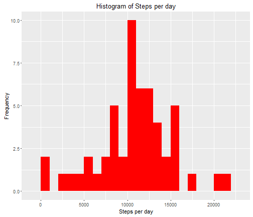
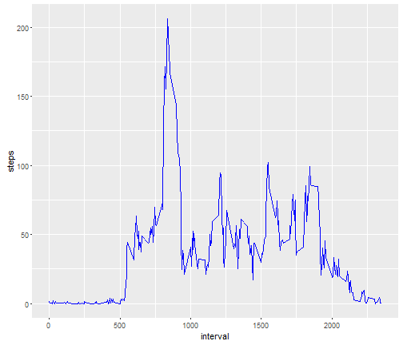
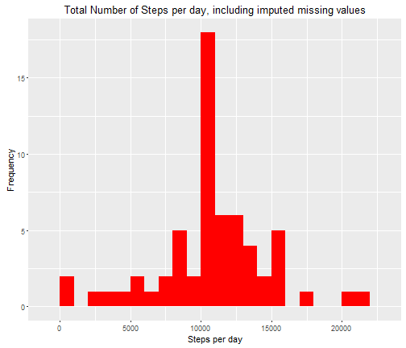
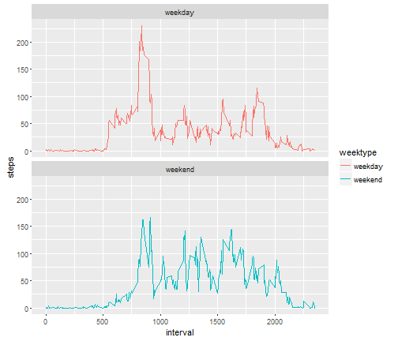

Coursera: Reproducible Research - Course Project 1:
========================================================

### August, 2016

# Introduction & Instructions
It is now possible to collect a large amount of data about personal movement using activity monitoring devices such as a Fitbit, Nike Fuelband, or Jawbone Up. These type of devices are part of the "quantified self" movement - a group of enthusiasts who take measurements about themselves regularly to improve their health, to find patterns in their behavior, or because they are tech geeks. But these data remain under-utilized both because the raw data are hard to obtain and there is a lack of statistical methods and software for processing and interpreting the data.

This assignment makes use of data from a personal activity monitoring device. This device collects data at 5 minute intervals through out the day. The data consists of two months of data from an anonymous individual collected during the months of October and November, 2012 and include the number of steps taken in 5 minute intervals each day.

The data for this assignment can be forked from GitHub [here](https://www.github.com/rdpeng/RepData_PeerAssessment1)

The variables included in this dataset are:

    steps: Number of steps taking in a 5-minute interval (missing values are coded as NA)
    date: The date on which the measurement was taken in YYYY-MM-DD format
    interval: Identifier for the 5-minute interval in which measurement was taken

The dataset is stored in a comma-separated-value (CSV) file and there are a total of 17,568 observations in this dataset.

## Loading required packages and Setting Global Options:
This assignment requires that all code be visible, so the echo option is set to TRUE globally below:

```r
library(knitr)
opts_chunk$set(echo=TRUE)
```

Other packages used in this analysis are as follows:

```r
library(dplyr)
library(lubridate)
library(ggplot2)
```


## Loading and and pre-processing the data:
Show any code that is needed to:

1. Load the data
2. Process/transform the data (if necessary) into a format suitable for your analysis

### Reading-in the data
**activity.csv should already be downloaded to your working directory.** If not, it can be downloaded using the link 
referenced in the Introduction above.


```r
data <- read.csv("activity.csv", header = TRUE, sep = ',', colClasses = c("numeric", "character",
                                                                          "integer"))
str(data)
```

```
## 'data.frame':	17568 obs. of  3 variables:
##  $ steps   : num  NA NA NA NA NA NA NA NA NA NA ...
##  $ date    : chr  "2012-10-01" "2012-10-01" "2012-10-01" "2012-10-01" ...
##  $ interval: int  0 5 10 15 20 25 30 35 40 45 ...
```

```r
summary(data)
```

```
##      steps            date              interval     
##  Min.   :  0.00   Length:17568       Min.   :   0.0  
##  1st Qu.:  0.00   Class :character   1st Qu.: 588.8  
##  Median :  0.00   Mode  :character   Median :1177.5  
##  Mean   : 37.38                      Mean   :1177.5  
##  3rd Qu.: 12.00                      3rd Qu.:1766.2  
##  Max.   :806.00                      Max.   :2355.0  
##  NA's   :2304
```

### Pre-processing the data using "Tidy Data" principles:
Adjust the date-time formatting using the lubridate package:

```r
data$date <- ymd(data$date)
```

And verify correct formatting:

```r
str(data)
```

```
## 'data.frame':	17568 obs. of  3 variables:
##  $ steps   : num  NA NA NA NA NA NA NA NA NA NA ...
##  $ date    : Date, format: "2012-10-01" "2012-10-01" ...
##  $ interval: int  0 5 10 15 20 25 30 35 40 45 ...
```

```r
head(data)
```

```
##   steps       date interval
## 1    NA 2012-10-01        0
## 2    NA 2012-10-01        5
## 3    NA 2012-10-01       10
## 4    NA 2012-10-01       15
## 5    NA 2012-10-01       20
## 6    NA 2012-10-01       25
```


## What is mean total number of steps taken per day?
For this part of the assignment, you can ignore the missing values in the dataset.

1. Calculate the total number of steps taken per day
2. If you do not understand the difference between a histogram and a barplot, research the difference between them. Make a histogram of the total number of steps taken each day
3. Calculate and report the mean and median of the total number of steps taken per day

### Calculate the total number of steps taken per day:

```r
steps <- data %>%
  filter(!is.na(steps)) %>%
  group_by(date) %>%
  summarise(steps = sum(steps))
steps
```

```
## Source: local data frame [53 x 2]
## 
##          date steps
##        (date) (dbl)
## 1  2012-10-02   126
## 2  2012-10-03 11352
## 3  2012-10-04 12116
## 4  2012-10-05 13294
## 5  2012-10-06 15420
## 6  2012-10-07 11015
## 7  2012-10-09 12811
## 8  2012-10-10  9900
## 9  2012-10-11 10304
## 10 2012-10-12 17382
## ..        ...   ...
```

### Create a histogram of the total steps taken each day:


```r
ggplot(steps, aes(x = steps)) +
  geom_histogram(fill = "red", binwidth = 1000) +
  labs(title = "Histogram of Steps per day", x = "Steps per day", y = "Frequency")
```



### Calculate and report the mean and median of the total number of steps taken per day:

```r
meanSteps <- mean(steps$steps, na.rm = TRUE)
```


```r
meanSteps
```

```
## [1] 10766.19
```


```r
medianSteps <- median(steps$steps, na.rm = TRUE)
```


```r
medianSteps
```

```
## [1] 10765
```

The Mean steps is 1.0766189 &times; 10<sup>4</sup> and the Median is 1.0765 &times; 10<sup>4</sup>.


## What is the average daily activity pattern?
1. Make a time series plot (i.e. type = "l") of the 5-minute interval (x-axis) and the average number of steps taken, averaged across all days (y-axis)
2. Which 5-minute interval, on average across all the days in the dataset, contains the maximum number of steps?

### Calculate the average number of steps taken, averaged across all days:

```r
interval <- data %>%
  filter(!is.na(steps)) %>%
  group_by(interval) %>%
  summarise(steps = mean(steps))
```

### Create a time series plot using ggplot2 package of the five-minute interval & average number of steps taken:

```r
ggplot(interval, aes(x=interval, y=steps)) + geom_line(color = "blue")
```



### Identify which 5-minute interval, averaged across all days, contains the maximum number of steps:

```r
max <- interval[which.max(interval$steps),]
max
```

```
## Source: local data frame [1 x 2]
## 
##   interval    steps
##      (int)    (dbl)
## 1      835 206.1698
```

On average across all days, interval 835 contains the maximum number of steps, which is 206.1698113.


## Imputing Missing Values:
**Note that there are a number of days/intervals where there are missing values (coded as NA)**. The presence of missing days may introduce bias into some calculations or summaries of the data.

1. Calculate and report the total number of missing values in the dataset (i.e. the total number of rows with NAs)
2. Devise a strategy for filling in all of the missing values in the dataset. The strategy does not need to be sophisticated. For example, you could use the mean/median for that day, or the mean for that 5-minute interval, etc.
3. Create a new dataset that is equal to the original dataset but with the missing data filled in.
4. Make a histogram of the total number of steps taken each day and Calculate and report the mean and median total number of steps taken per day. Do these values differ from the estimates from the first part of the assignment? What is the impact of imputing missing data on the estimates of the total daily number of steps?

### Identify, calculate, and report the total number of missing values in the dataset:

```r
sum(is.na(data$steps))
```

```
## [1] 2304
```

Total number of rows with missing values is 2304.

### Strategy for imputing missing values:
Let's fill in missing values with the mean number of steps for that interval. 

### Create a new dataset with all missing values imputed using the method described above...


```r
dataImputed <- data
nas <- is.na(dataImputed$steps)
avg_interval <- tapply(dataImputed$steps, dataImputed$interval, mean, na.rm=TRUE, simplify=TRUE)
dataImputed$steps[nas] <- avg_interval[as.character(dataImputed$interval[nas])]
```

### ... And check to verify that no missing values exist in the new dataset "dataImputed"

```r
sum(is.na(dataImputed$steps))
```

```
## [1] 0
```

### Calculate the number of steps taken in each 5-minute interval per day, and group by interval. Then create the histogram:

```r
steps_full <- dataImputed %>%
  filter(!is.na(steps)) %>%
  group_by(date) %>%
  summarize(steps = sum(steps))
steps_full
```

```
## Source: local data frame [61 x 2]
## 
##          date    steps
##        (date)    (dbl)
## 1  2012-10-01 10766.19
## 2  2012-10-02   126.00
## 3  2012-10-03 11352.00
## 4  2012-10-04 12116.00
## 5  2012-10-05 13294.00
## 6  2012-10-06 15420.00
## 7  2012-10-07 11015.00
## 8  2012-10-08 10766.19
## 9  2012-10-09 12811.00
## 10 2012-10-10  9900.00
## ..        ...      ...
```


```r
ggplot(steps_full, aes(x = steps)) +
  geom_histogram(fill = "red", binwidth = 1000) +
  labs(title = "Total Number of Steps per day, including imputed missing values", 
       x = "Steps per day", y = "Frequency")
```



### Calculate the mean and median number of steps from the complete, imputed dataset:

```r
meanSteps_all <- mean(steps_full$steps, na.rm = TRUE)
```


```r
meanSteps_all
```

```
## [1] 10766.19
```


```r
medianSteps_all <- median(steps_full$steps, na.rm = TRUE)
```


```r
medianSteps_all
```

```
## [1] 10766.19
```

Once all missing data has been imputed, the mean and median number of steps are equivalent: 1.0766189 &times; 10<sup>4</sup>.


## Are there differences in activity patterns between weekdays and weekends?
For this part the weekdays() function may be of some help here. Use the dataset with the filled-in missing values for this part.

1. Create a new factor variable in the dataset with two levels - "weekday" and "weekend" indicating whether a given date is a weekday or weekend day.
2. Make a panel plot containing a time series plot (i.e. type = "l") of the 5-minute interval (x-axis) and the average number of steps taken, averaged across all weekday days or weekend days (y-axis). See the README file in the GitHub repository to see an example of what this plot should look like using simulated data.

### Create a new factor variable to indicate weekdays versus weekends:

```r
dataImputed <- mutate(dataImputed, weektype = ifelse(weekdays(dataImputed$date) == "Saturday" | weekdays(dataImputed$date) == "Sunday", "weekend", "weekday"))
dataImputed$weektype <- as.factor(dataImputed$weektype)
head(dataImputed)
```

```
##       steps       date interval weektype
## 1 1.7169811 2012-10-01        0  weekday
## 2 0.3396226 2012-10-01        5  weekday
## 3 0.1320755 2012-10-01       10  weekday
## 4 0.1509434 2012-10-01       15  weekday
## 5 0.0754717 2012-10-01       20  weekday
## 6 2.0943396 2012-10-01       25  weekday
```

```r
summary(dataImputed$weektype)
```

```
## weekday weekend 
##   12960    4608
```

### Make a panel plot containing a time series plot of the 5-minute interval (x-axis) and the average number of steps taken:

- Calculate the average steps for the 5-minute interval:


```r
interval_full <- dataImputed %>%
  group_by(interval, weektype) %>%
  summarise(steps = mean(steps))
```

- Create the time series plot with the 5-minute interval for weekday and weekend:

```r
compare <- ggplot(interval_full, aes(x=interval, y=steps, color = weektype)) +
  geom_line() +
  facet_wrap(~weektype, ncol = 1, nrow=2)
compare
```



### Comparing Activity during Weekdays versus Weekends:
During weekdays, a large increase is seen in the subject's activity early in the day, followed by periods of low activity before another period of high activity late in the day. The subject is more active overall during weekend days, and has 
more consistent periods of higher activity throughout those days.
